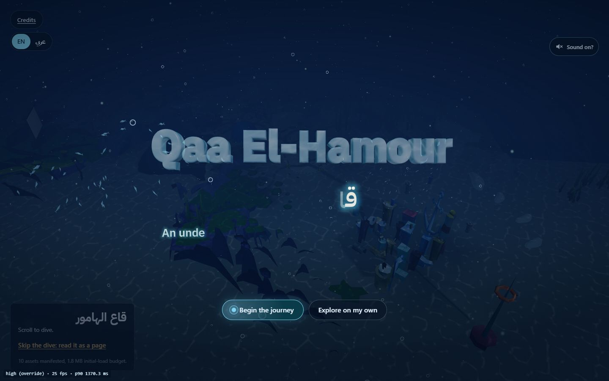

# قاع الهامور — Qaa El-Hamour

An interactive WebGL personal site, and a template you can fork. It is themed on the Egyptian
trend "Qaa El-Hamour" (قاع الهامور, roughly "the bottom of the grouper's sea"), in which people
joked about an underwater parallel state with its own bureaucracy. A scroll-driven camera dive
through an ocean town stands in for a portfolio: the Pineapple is the bio, the Tiki Head the
résumé, the Krusty Krab the services menu, and a Municipal Complaints Bureau replaces the contact
form. Content, branding and assets come from data files, so forking is editing configuration,
not components.



**Live:** <https://abdallah-khalil.github.io/> (the owner's deployment of this repository)

## Features

- **Cinematic tour.** A first-time visitor gets an intro and a hands-free journey that flies the
  camera to each landmark; the free dive is one click away ([docs/tour.md](docs/tour.md)).
- **Narrators with animation.** Each landmark has a narrator that talks, waves and reacts when
  poked. The template's own cast (the Hamour, the Sardine President, the Crab Clerk) is built in
  code; optional bundled models are described under [Licences](#licences).
- **Voice babble and ambient audio.** Narrators "speak" in synthesized babble, with UI sounds and a
  looping music bed. Sound is off until the visitor's first gesture and downloads nothing before
  then ([docs/audio.md](docs/audio.md)).
- **3D text.** The title and the narrators' speech bubbles are drawn in the water
  ([docs/ocean-text.md](docs/ocean-text.md)).
- **Bilingual, Arabic and English**, right to left where needed; `locales: ['en']` turns Arabic off.
- **Reduced motion and no WebGL.** With reduced motion every landmark opens as a dialog; without
  WebGL (or with `?view=page`) the site loads as an ordinary page with the same content.
- **Complaints Bureau contact form.** Sends through Web3Forms or Formspree, or says honestly that
  it is not wired ([docs/contact.md](docs/contact.md)).
- **Performance budget.** The 3D code is a lazy chunk; `npm run perf:budget` fails the build when a
  budget is exceeded ([docs/perf-budget.md](docs/perf-budget.md)).
- **Content Security Policy** written into the page at build time, following the providers you
  configure ([docs/security.md](docs/security.md)).

## Quick start

Requires Node.js 22 (what CI uses) and npm.

```bash
npm ci
npx nx serve web        # http://localhost:4200   (npx nx dev web is the same dev server)
```

Check everything:

```bash
npx nx run-many -t lint typecheck test build
```

## Fork and deploy

Follow these in order. The detail for each step is in the linked page; the commands below are the
ones those pages and the CI workflows use.

### 1. Fork and install

Fork `Hive-Academy/qa3elhamor` on GitHub, clone your fork, then `npm ci`.

### 2. Start from sample content

`content/` holds the owner's real profile. Do not deploy it as yours.

```bash
npm run template:reset   # copies content.example/*.json over content/
```

This installs a fictional resident ("Sam Reef"). Edit `content/*.json` to be you (rules in
[`content/README.md`](content/README.md)), delete the `"_sample"` note in each file, then check:

```bash
npx nx validate content-data-access
```

Prefer a form to JSON? [docs/cms.md](docs/cms.md) covers the optional CMS.

### 3. Rebrand

[docs/template.md](docs/template.md) is the full walkthrough (about 30 minutes). The switches live
in `apps/web/src/site.config.ts`:

| Export | What it controls |
| --- | --- |
| `SITE` | Brand name and masthead, `<head>` metadata, the colour theme and fonts, the water, and `locales` |
| `LANDMARKS`, `LANDMARK_PLACEMENTS` | Landmark names, models and positions |
| `DIVE_CONFIG` | The camera route and pacing |
| `NARRATOR_CAST` | Who narrates each landmark, and `bundledByDefault` |
| `TOUR` | `enabled: false` removes the intro and the journey |
| `AUDIO` | The music bed (`music: null, ambience: false` removes sound entirely) |

**Set `NARRATOR_CAST.bundledByDefault` to `false`.** It is `true` only for the owner's site and
turns on the SpongeBob and Patrick narrators, which are Nickelodeon characters (see
[Licences](#licences)). Also replace the favicon (`apps/web/public/favicon.ico`) and the owner's
URLs listed in docs/template.md, section 0.

### 4. Contact form (optional)

Set `VITE_CONTACT_PROVIDER` to `web3forms` or `formspree` plus its key or form id
([docs/contact.md](docs/contact.md)). Unset, the form says it is not wired and sends nothing.
Locally, copy `.env.example` to `.env` (the wall variables in it can stay as they are).

### 5. Deploy to GitHub Pages

The site is static. The workflow `.github/workflows/deploy-pages.yml` runs only when started by hand
(Actions, "Deploy to GitHub Pages", Run workflow) and publishes only if `publish` is ticked.
Unticked, it is a full build-and-check dry run, so start there. Full details:
[docs/deploy.md](docs/deploy.md).

**Your own user site** (`https://<you>.github.io/`):

1. Create the repository `<you>/<you>.github.io`, and in its Settings, Pages, choose "Deploy from a
   branch" with your publishing branch and `/ (root)`.
2. Create an SSH deploy key (`ssh-keygen -t ed25519 -N "" -C "pages-deploy" -f pages_deploy_key`).
   Add the public half to the Pages repository as a deploy key **with write access**, and the
   private half to your fork as the secret `PAGES_DEPLOY_KEY`. Delete the local key files.
3. In your fork, Settings, Secrets and variables, Actions, set the variables `PAGES_REPOSITORY`
   (`<you>/<you>.github.io`) and `PAGES_BRANCH` (its publishing branch). Leave `SITE_BASE` unset.
   Optionally set `SITE_URL` (`https://<you>.github.io/`) for social previews, and the contact
   variables from step 4.
4. Run the workflow as a dry run, then again with `publish` ticked.

**A project site** (`https://<you>.github.io/<repo>/`): set the variable `SITE_BASE` to `/<repo>/`
(and optionally `SITE_URL`), then build and push the output yourself:

```bash
SITE_BASE=/<repo>/ npx nx run web:build --skip-nx-cache
SITE_BASE=/<repo>/ npm run deploy:prepare
# publish the contents of apps/web/dist to your gh-pages branch
```

On Windows Git Bash use `SITE_BASE=<repo>` without slashes (docs/template.md, section 7). For a
custom domain leave `SITE_BASE` unset and add a `CNAME` file under `apps/web/public/`.

What the build leaves out of the published site on purpose (the moderation console and `/admin`) is
explained in docs/deploy.md. The optional complaints wall needs a server (`apps/api` and Postgres,
`docs/security.md`) and stays off on a static host.

Before you publish, read the checklist at the end of docs/template.md ("What you must not ship").

## Project layout

```
apps/web/            The React + R3F site and the composition root (site.config.ts lives here)
apps/web-e2e/        Playwright end-to-end and visual specs
apps/api/            Optional serverless handlers for the complaints wall (Fetch API shape)
libs/world/          The 3D world: asset manifest and credits (domain), scene (feature), audio, UI
libs/dive/           Scroll-driven camera path
libs/landmarks/      Landmark definitions, scenes and overlays (see its README)
libs/content/        Content model and the loader that validates content/*.json
libs/complaints/     Complaint model, wall data access and API feature
libs/telemetry/      Optional cookieless analytics
libs/shared/         Result type, pure math, the web-to-api type channel
content/             The site's words, as JSON (content.example/ is the neutral sample)
assets/              Source 3D models and audio sources, with their licences
tools/               Asset pipeline, perf budget, deploy helpers, template reset
docs/                Guides, one per topic
```

Libraries carry `scope:`, `type:` and `platform:` tags, enforced by `@nx/enforce-module-boundaries`
in `eslint.config.mjs`. Scene libraries never import content: `apps/web` is the only place that
wires the two together, which is what makes a fork a matter of editing data.

## Scripts

| Command | Does |
| --- | --- |
| `npx nx serve web` | Dev server on port 4200 |
| `npx nx run web:build` | Production build into `apps/web/dist` |
| `npx nx run-many -t lint typecheck test` | Static checks and unit tests |
| `npx nx validate content-data-access` | Validate `content/*.json` |
| `npm run assets:compress` / `assets:verify` | Build / check the compressed 3D models |
| `npm run perf:budget` | Check the built site against the budgets |
| `npm run template:reset` | Replace `content/` with the sample content |
| `npm run deploy:check-contact` / `deploy:prepare` | Check the contact config / shape the Pages artefact |
| `npm run cms:local` | Local backend for the optional CMS |
| `npm run db:up`, `db:migrate`, `api:dev` | The optional complaints wall's database and API |

## Testing

Unit and component specs sit beside the code (`npx nx run-many -t test`). End-to-end and visual
specs run in real Chromium: `npx playwright install chromium` once, then
`npx nx run web-e2e:e2e`. The e2e specs are written against the owner's landmark names and copy;
[docs/testing.md](docs/testing.md) explains what is covered and how to adapt it. CI
(`.github/workflows/ci.yml`) also runs the asset check, the CSP spec and the performance budget.

## Licences

- **Code: MIT** ([`LICENSE`](LICENSE)), copyright 2026 Abdallah Khalil. This covers the source
  code only.
- **Everything else keeps its own licence**: four CC-BY-4.0 Sketchfab models (attribution
  required), a CC0 music track, the OFL-licensed fonts, and the site owner's personal content.
  The full list, including which files are modified, is in [`NOTICE.md`](NOTICE.md). The site
  renders the model and music credits itself; keep them if you fork.
- **Characters.** SpongeBob and Patrick are Nickelodeon / Paramount intellectual property. The
  model licences cover the mesh files, not the characters. This is an unofficial, non-commercial
  fan parody, and the site's branding is the Egyptian trend, not SpongeBob. The switch is
  `NARRATOR_CAST.bundledByDefault` in `site.config.ts`; it is `true` in this repository because
  the owner's site uses the characters and accepts that risk. A fork should set it to `false`
  (step 3 above), which falls back to the original cast built in code.

## Contributing

Work proceeds one roadmap item at a time. Pick an unchecked item from
[`.ptah/roadmap.md`](.ptah/roadmap.md) and read its `Depends on:` line. Decisions made during
discovery, and why, are in [`.ptah/scope-decisions.md`](.ptah/scope-decisions.md).
